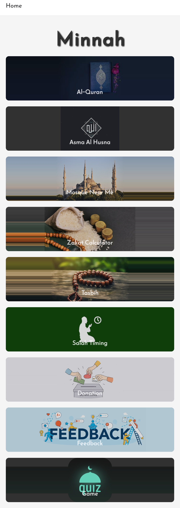
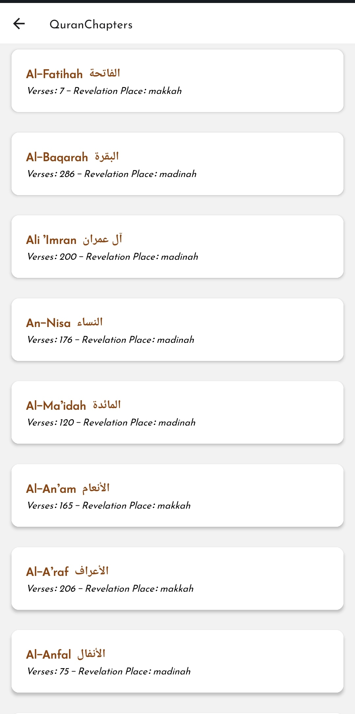
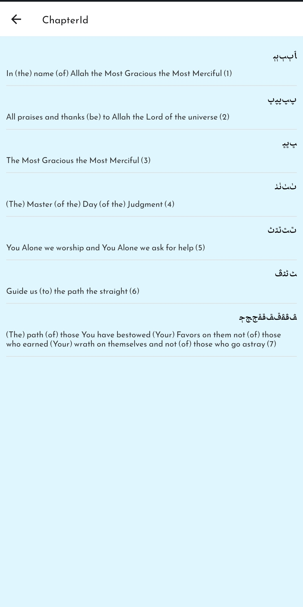
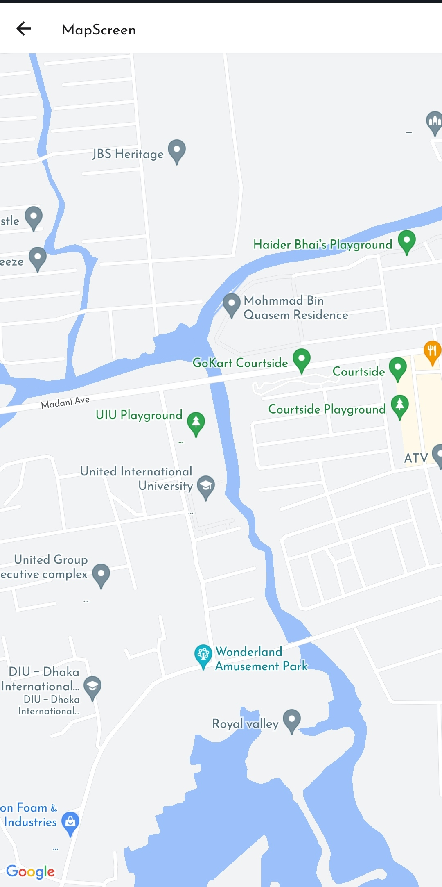
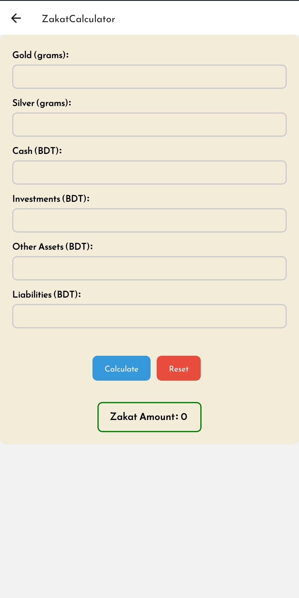
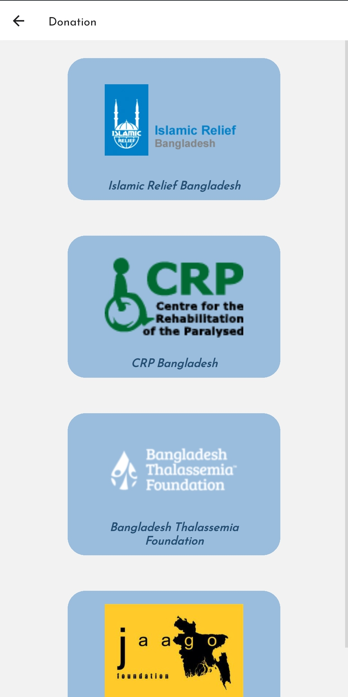
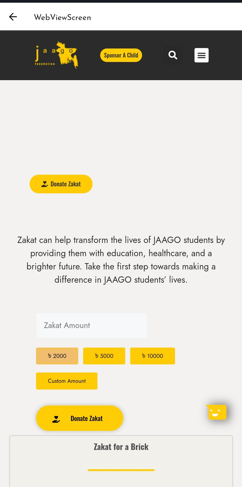

# System Features

The "Minnah" app offers a plethora of features that cater to different aspects of Islamic practice. These features are designed to provide users with tools to enhance their spiritual journey, seamlessly integrating faith into their daily lives.

## Homepage

## All Verse From Quran

## Read verse

## Mosque Near Me

## Zakat Calculator

## Tasbih

## Prayer Reminder

## Donation

## Quiz

## Feedback

